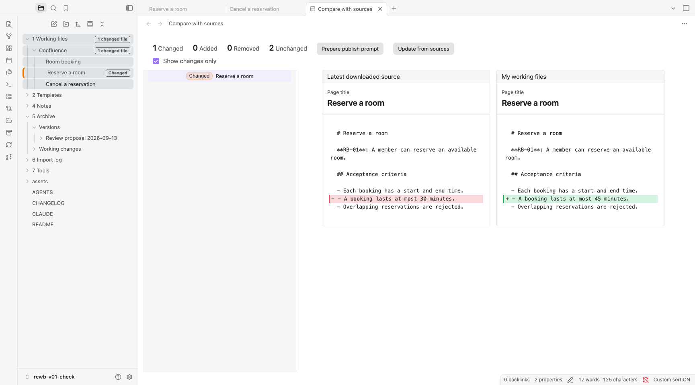
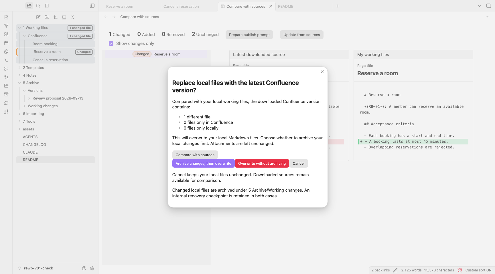

# RE Workbench

**v0.1 · Public beta**

**Use AI to improve shared requirements without losing source traceability or control.**

RE Workbench gives product owners and requirements engineers a local workspace to read Confluence requirements, improve them with AI, compare changes and decide what returns to the shared space.



*A small local change compared with its source. Fictional example.*

## Why I built this

When I work on requirements in collaborative projects, I want to try different wording, compare alternatives or ask AI for a review before updating Confluence or other shared tools. RE Workbench gives me space to do that locally while keeping the connection to the source.

I know there are tools that automate the whole workflow in one place. Here, I find a little friction useful: transferring changes is a separate step where I check the requirements again for consistency and decide what belongs in the shared documentation.

## Available now

- 📥 Read-only Confluence import and traceable local working copies.
- 🔎 Source comparison and controlled replacement.
- 📦 Named archives and recovery checkpoints.
- 📤 Manual or explicitly authorized AI-assisted transfer.
- 📝 Reusable example RE skills and templates, adaptable to project conventions.

## Who is this for — and what is needed?

- **For product owners, requirements engineers and business analysts** revising requirements in collaborative projects.
- **A Mac.** The current setup is built and checked on macOS. Other operating systems need setup changes and their own testing.
- **Your own active AI-agent access.** Setup assumes an advanced model that can follow multi-step instructions, work with local files and run tools. Basic chat access alone is not enough; no AI account or model is included.
- **A project and access to its requirements.** v0.1 imports from **Confluence Cloud**. Other sources require adapting the importer; they are not supported out of the box.
- **Basic Obsidian knowledge.** Be comfortable opening a vault, editing notes and enabling plugins.
- **One dedicated vault per project and Confluence space.** Use it only as that project's requirements workbench.

## Review before replacing local files



Replacement requires a choice. Cancellation preserves the draft; overwriting retains an internal recovery checkpoint. Archiving first also saves the changed Markdown files in a visible folder.

## 🛠️ Main functions

| Action | What happens |
| --- | --- |
| 📥 Read a space or selected pages | Import a whole accessible space, selected page trees, or individual pages. |
| ✏️ Edit locally | Work on ordinary Markdown files in Obsidian, manually or with an AI assistant. |
| 🔎 Compare with sources | See edits, additions and deletions against the latest successful download. This does not contact Confluence. |
| 🔄 Update from sources | Download the current selection, then decide whether to replace the working files. |
| 📦 Archive working files | Save the complete Markdown collection in a named folder under `5 Archive/Versions`. |
| 📤 Prepare publish prompt | Prepare an AI request for the affected existing pages. Sending it is a separate action. |

**Update from sources** downloads first. The replacement dialog offers comparison, cancellation, archiving before overwrite, or explicit overwrite without a file archive. Overwriting replaces the complete managed Markdown tree, including local-only files. Both overwrite options retain an internal recovery checkpoint. Existing archive names are never overwritten.

[Working-file status and renaming](7%20Tools/README.md#working-file-details).

## Bring selected changes back

Review the comparison, then transfer selected changes:

- Open the linked Confluence page, check its current content and copy the changes manually.
- Use **Prepare publish prompt** and send the reviewed request to an authorized assistant. It checks remote versions, preserves the previous content and skips conflicts, following the [Confluence skill](7%20Tools/Skills/confluence-workflow/SKILL.md).

Preparing a prompt does not publish; sending it authorizes the listed existing-page updates, not remote creation or deletion. Review the result and run **Update from sources** afterwards.

## 🚀 Get started

1. Clone this repository or use **Code → Download ZIP** and extract it.
2. Open the folder in an AI assistant with access to local files and tools, then send:

   > Read AGENTS.md and follow 7 Tools/Skills/confluence-workflow/SKILL.md to set up this vault. Help me connect my Confluence space and test a small read-only import.

3. Follow the setup guidance, then open the folder as a vault in Obsidian and enable RE Workbench.

The download is an empty starter; setup installs the dependencies.

To work with an existing Confluence collection, run **Update from sources**, review the download and confirm copying it into the working files. Edit under `1 Working files/Confluence` and use **Compare with sources** to inspect changes.

File Color is optional. The demo highlights `1 Working files` in blue; change the colour in the File Color plugin settings to suit your preferences. All Workbench functions work without it.

Setup checks for Git, Node.js and Python 3. Store the Confluence token outside chat and workspace files, and use an AI service approved for the project material.

### Manual setup

Setup can also be completed without an assistant. Follow the [installation and plugin checklist](7%20Tools/README.md), then the configuration and connection-test steps in the [Confluence workflow](7%20Tools/Skills/confluence-workflow/SKILL.md#setup).

## 🤖 Work with AI skills

The project includes instructions an assistant can read directly. Global installation is not required.

The user-story and use-case skills are **examples and placeholders**. Adapt or replace them with the project's own terminology, templates and review criteria, and add further tools as needed. The Confluence skill covers technical setup and transfer checks.

| Skill | Use it for |
| --- | --- |
| [Confluence workflow](7%20Tools/Skills/confluence-workflow/SKILL.md) | Setup, reading a source, repairing supported file associations and checking explicitly requested publication. |
| [User stories](7%20Tools/Skills/user-stories/SKILL.md) | Drafting or reviewing user stories and testable acceptance criteria. |
| [Use cases](7%20Tools/Skills/use-cases/SKILL.md) | Describing a user goal, the main flow and relevant alternatives or failures. |

The [templates](2%20Templates/README.md) also work without AI.

## Recommended extras for RE and BA work

Optional additions for writing, sketching and reviewing requirements. None is required or bundled with RE Workbench.

### AI-agent skills

| Skill | Why I recommend it |
| --- | --- |
| [Obsidian Skills by kepano](https://github.com/kepano/obsidian-skills) | Helps the agent work with Obsidian Markdown, links, properties, Bases and Canvas files. |
| [Humanizer](https://github.com/blader/humanizer) / [Humanizer DE](https://github.com/marmbiz/humanizer-de) | Useful for editing stiff or verbose AI drafts in English or German. Keep requirement terminology and acceptance criteria precise when revising wording. |

Install skills in the AI agent using the instructions in their repositories.

### Obsidian plugins

| Plugin | Why I recommend it |
| --- | --- |
| [Excalidraw](https://github.com/zsviczian/obsidian-excalidraw-plugin) | Sketch process flows, system boundaries and workshop ideas alongside the requirements. |
| [PUML Viewer](https://github.com/andreykolygin/obsidian-puml-viewer) | View and export PlantUML and Mermaid diagrams, useful for process and interaction models. Diagram code is sent to the configured renderer; use a local or project-approved server. |
| [Image Converter](https://github.com/xRyul/obsidian-image-converter) | Resize, compress and annotate screenshots before adding them to specifications. |
| [Image Toolkit](https://github.com/obsidian-community/obsidian-image-toolkit) | Zoom and pan through screenshots and diagrams when reviewing details. |

Install plugins separately through **Settings → Community plugins → Browse**. Choose only those useful for the project.

## 📁 Workspace folders

| Folder | Purpose |
| --- | --- |
| `1 Working files` | Editable local requirements. |
| `1 Sources` | Downloaded source files, managed by the importer. |
| `2 Templates` | Starting points for stories and use cases. |
| `4 Notes` | Private notes and open questions. |
| `5 Archive` | Named archives and recovery copies. |
| `6 Import log` | Import results and publishing reports. |
| `7 Tools` | Plugin source, setup instructions and skills. |

Sources are hidden from normal navigation. Back up the whole vault, including `.rewb-history`, to preserve recovery history. Hidden folders and Git ignore rules do not protect deliberately shared files.

## Architecture and validation

The importer writes Markdown and source metadata. The plugin keeps immutable snapshots and recovery history in a local Git store, compares native working files and saves named archives as ordinary folders.

```text
Confluence → read-only import → source snapshot → local working files
                                                       ↓
Confluence ← deliberate transfer ← comparison and review
```

**73 Node tests and 12 Python importer tests** cover the MVP. See [test commands](7%20Tools/README.md#verify-a-development-copy) and the [validation record](7%20Tools/Validation.md) for completed checks and outstanding live-connection testing.

## Product case study

| | Decision or result |
| --- | --- |
| Problem | AI-assisted editing of shared requirements can lose source context, draft status and publication control. |
| Product decisions | Read-only ingestion, separate sources and working files, explicit replacement, recoverable checkpoints and human-reviewed publication. Source evidence remains authoritative. |
| Current result | A local MVP with an Obsidian plugin, importer, comparison, archiving, example skills and templates, covered by 85 automated tests. |
| Next hypothesis | For larger collections, a wiki and hybrid retrieval may improve context selection. |

## 🧭 Roadmap

Planned beyond v0.1:

- GitHub/GitLab imports and additional source collections.
- An optional knowledge wiki linked to original sources.
- Combined exact and semantic search for larger collections.

## MVP limits

Confluence pages are converted to Markdown. Complex macros, images and attachments are not fully supported, and conversion warnings need review. The workflow does not promise a lossless round trip. The importer retains missing source pages and flags them rather than treating their absence as deletion.

This public beta is a local, macOS-focused open-source MVP. Windows, Linux and Confluence Data Center setup are not covered. It has no background sync, automatic publishing or shared editing service. File replacement handles errors with rollback, but storage is not crash-atomic and does not coordinate simultaneous writers.

[Technical setup and recommended plugins](7%20Tools/README.md) · [Report a problem](https://github.com/mneuschaefer/RE-Workbench/issues)

## License

RE Workbench is available under the [MIT License](LICENSE). Obsidian and third-party plugins have their own licenses. Third-party plugins are installed separately through Obsidian; neither the source template nor the downloadable starter bundles them.
